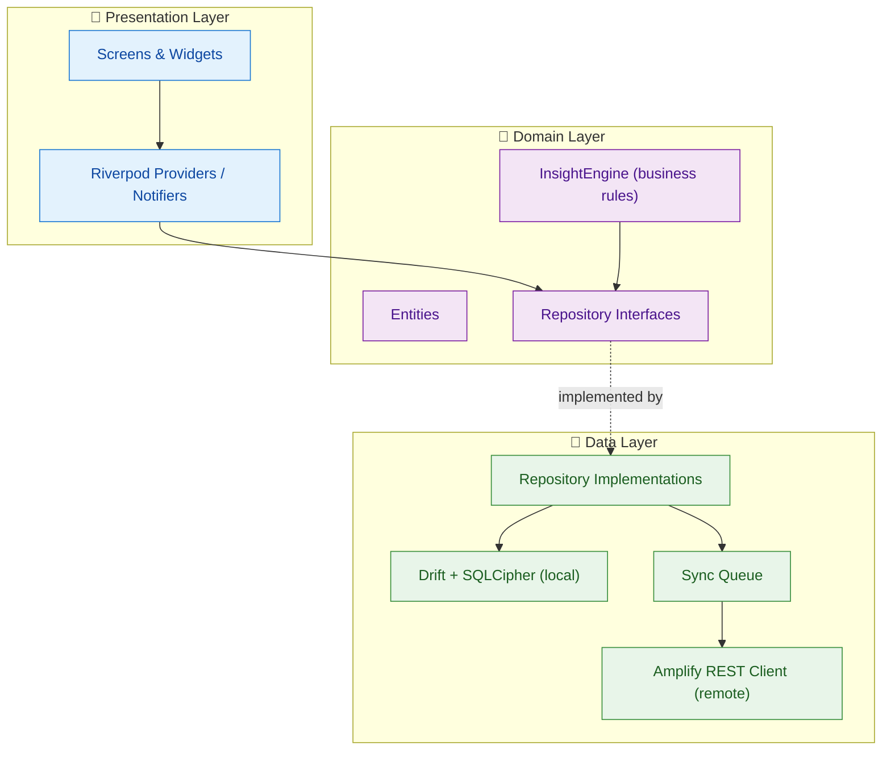
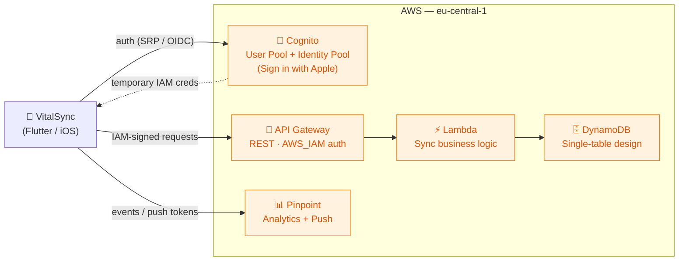
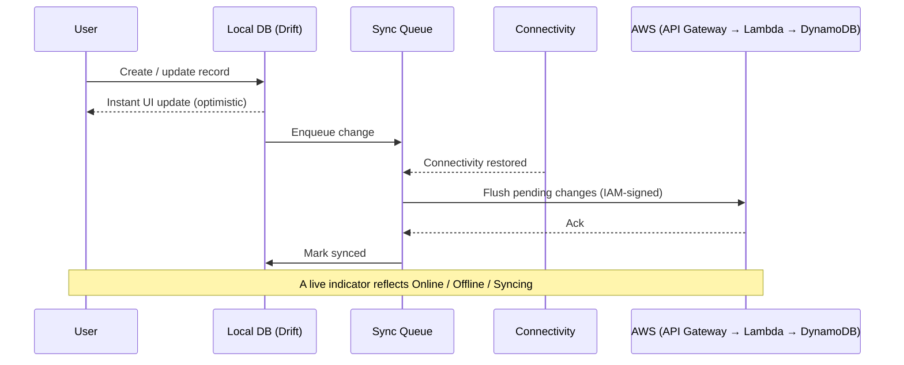

<div align="center">

# 🩺 VitalSync

### Health & Fitness Companion — with a cross-domain insight engine

A production-grade Flutter application that unifies **medication management**, **symptom tracking**, and **workout logging** into a single experience — then analyzes them *together* to surface personalized, actionable insights.

[](https://flutter.dev)
[](https://dart.dev)
[](https://aws.amazon.com/amplify/)
[](https://www.apple.com/ios/)
[](#-architecture)
[](#)
[](LICENSE)

</div>

---

## 📋 Table of Contents

- [Overview](#-overview)
- [The Differentiator: InsightEngine](#-the-differentiator-insightengine)
- [Key Features](#-key-features)
- [Screenshots](#-screenshots)
- [Architecture](#-architecture)
- [Backend Architecture (AWS)](#-backend-architecture-aws)
- [Offline-First Sync](#-offline-first-sync)
- [Tech Stack & Rationale](#-tech-stack--rationale)
- [Data Model](#-data-model)
- [Security & Privacy](#-security--privacy)
- [Project Structure](#-project-structure)
- [Getting Started](#-getting-started)
- [Testing](#-testing)
- [Roadmap](#-roadmap)
- [License](#-license)

---

## 🎯 Overview

Most health apps treat *medication*, *symptoms*, and *fitness* as isolated silos. **VitalSync's premise is that the value lives in the correlations between them** — e.g. *"Your symptom severity drops on weeks where you maintain a workout streak"* or *"Medication adherence is 23% lower on weekends."*

VitalSync is built as a **real product**, not a tutorial demo:

- **Offline-first** — full functionality without a network; changes sync when connectivity returns.
- **Privacy by design** — local database is encrypted at rest (SQLCipher / AES-256); GDPR consent, data export, and a Privacy Manifest are first-class.
- **Cloud-backed** — AWS Cognito auth (incl. Sign in with Apple) and a serverless sync backend.
- **Localized** — English, Turkish, and German out of the box.

> **Scale:** ~40K hand-written lines of Dart across 240+ files, 15 database tables, 34 screens, 3 feature modules, and a rule-based analytics engine — **with `flutter analyze` reporting 0 issues.**

---

## 💡 The Differentiator: InsightEngine

The heart of VitalSync is a **rule-based, cross-module analytics engine** written in pure Dart — no external ML dependencies, fully testable, and fully explainable.

It runs **10 correlation rules** across health and fitness data, each with minimum-sample-size guards and duplicate-prevention logic:

| Rule | What it detects |
|------|-----------------|
| `med_workout_correlation` | Relationship between medication adherence and workout activity |
| `symptom_exercise_pattern` | How exercise correlates with symptom occurrence |
| `compliance_streak_correlation` | Whether workout streaks track with medication compliance |
| `compliance_weekday_pattern` | Day-of-week dips in medication adherence |
| `symptom_trend` | Rising/falling symptom severity over time |
| `med_adherence_milestone` | Adherence achievement milestones |
| `volume_plateau` | Training-volume plateaus in fitness |
| `rest_day_suggestion` | Recovery recommendations based on load |
| `workout_consistency` | Consistency scoring and nudges |
| `pr_proximity` | Proximity to personal records |

**Why rule-based instead of ML?** Health recommendations must be *explainable* and *deterministic* — a user (and a regulator) should be able to understand exactly why a suggestion appeared. The architecture is intentionally pluggable, so an ML/LLM layer can be added later (see [Roadmap](#-roadmap)) without rewriting the domain.

> 📄 See [`lib/features/insights/domain/insight_engine.dart`](lib/features/insights/domain/insight_engine.dart) and its [test suite](test/features/insights/domain/insight_engine_test.dart).

---

## ✨ Key Features

### 🏥 Health
- **Medication management** — schedules, dosages, and reminders via local notifications.
- **Adherence logging** — taken / skipped / missed status tracking with history.
- **Symptom tracking** — severity logging and a unified health timeline.

### 💪 Fitness
- **Workout logging** — sessions, sets, reps, and weights with a live active-workout screen.
- **Exercise library** & **reusable templates**.
- **Progress analytics** — volume charts, personal records, streaks, and achievements.

### 📊 Insights
- **Cross-module insights** generated by the [InsightEngine](#-the-differentiator-insightengine).
- **Weekly reports** summarizing health + fitness in one view.
- Prioritized, categorized, and time-bounded insight cards.

### 🧩 Platform
- **Unified dashboard** with a context-aware Floating Action Button.
- **Glassmorphic UI** with Material You dynamic theming.
- **Real-time sync indicator** (Online / Offline / Syncing).
- **Biometric lock** (Face ID / Touch ID).
- **Onboarding** + **GDPR consent** flows.
- **Localization** — EN / TR / DE.

---

## 📸 Screenshots

> _Add screenshots/GIFs here. Recommended: Dashboard, an Insight card, Active Workout, Weekly Report, and the sync indicator in action._

| Dashboard | Insights | Active Workout | Weekly Report |
|:---:|:---:|:---:|:---:|
| _coming soon_ | _coming soon_ | _coming soon_ | _coming soon_ |

---

## 🏗 Architecture

VitalSync follows **Clean Architecture** with a **feature-first** organization. Each feature (`health`, `fitness`, `insights`) is split into `domain` and `presentation`, while cross-cutting concerns live in `core` and the data layer is shared.



**Principles applied**

- **Dependency Rule** — domain depends on nothing; data and presentation depend inward.
- **Dependency Injection** — `get_it` + `injectable` wire implementations to interfaces.
- **Single source of truth** — the local Drift database; the cloud is a sync target, not the primary read path (offline-first).
- **Testability** — repositories are mocked (`mocktail`) so domain logic is unit-tested in isolation.

---

## ☁️ Backend Architecture (AWS)

The backend is **serverless**, provisioned via **AWS Amplify**, and hosted in **`eu-central-1` (Frankfurt)** for EU data residency.



| Service | Role |
|---------|------|
| **Cognito** | Authentication (email/password via SRP, **Sign in with Apple** via OIDC federation) and temporary IAM credentials |
| **API Gateway** | REST entry point secured with `AWS_IAM` (requests are SigV4-signed with the user's Cognito credentials) |
| **Lambda** | Serverless sync/business logic |
| **DynamoDB** | Single-table design (`PK` / `SK`) for user-scoped records |
| **Pinpoint** | Product analytics and push-notification delivery |

> **Why IAM auth on the API?** Each request is signed with the authenticated user's short-lived AWS credentials, so authorization is enforced at the AWS layer — no bearer tokens to leak, and per-user data isolation can be expressed directly in IAM policies.

---

## 🔄 Offline-First Sync

VitalSync is designed to be **fully usable with no connection**. The local encrypted database is the source of truth; the cloud is reconciled opportunistically.



- Writes apply **locally first** for an instant, optimistic UI.
- A dedicated **`sync_queue`** table durably tracks pending changes.
- `connectivity_plus` triggers a flush when the network returns.
- Background reconciliation runs via `workmanager`.

---

## 🛠 Tech Stack & Rationale

Every dependency was a deliberate choice — here's the *why*, not just the *what*.

| Concern | Choice | Why this one |
|---------|--------|--------------|
| **State management** | [Riverpod](https://riverpod.dev) | Compile-safe, testable, no `BuildContext` coupling; scales cleanly with code-gen. |
| **Navigation** | [GoRouter](https://pub.dev/packages/go_router) | Declarative, deep-link friendly, auth-redirect guards. |
| **Local DB** | [Drift](https://drift.simonbinder.eu) | Type-safe, compile-checked SQL with reactive streams — ideal for an offline-first source of truth. |
| **Encryption at rest** | [SQLCipher](https://pub.dev/packages/sqlcipher_flutter_libs) | Transparent AES-256 on the SQLite file — health data is never stored in plaintext. |
| **DI** | [get_it](https://pub.dev/packages/get_it) + [injectable](https://pub.dev/packages/injectable) | Decouples interfaces from implementations; keeps the domain layer pure. |
| **Backend** | [AWS Amplify](https://aws.amazon.com/amplify/) | Managed Cognito + serverless stack with EU data residency. |
| **Auth** | Cognito + [sign_in_with_apple](https://pub.dev/packages/sign_in_with_apple) | Required for iOS social login; OIDC-federated into Cognito. |
| **Secure storage** | [flutter_secure_storage](https://pub.dev/packages/flutter_secure_storage) | Keychain-backed storage for the DB key and secrets. |
| **Biometrics** | [local_auth](https://pub.dev/packages/local_auth) | Face ID / Touch ID app lock. |
| **Charts** | [fl_chart](https://pub.dev/packages/fl_chart) | Customizable progress and trend visualizations. |
| **Background work** | [workmanager](https://pub.dev/packages/workmanager) | Periodic sync + reminder scheduling. |
| **Notifications** | [flutter_local_notifications](https://pub.dev/packages/flutter_local_notifications) | Timezone-aware medication reminders. |
| **Theming** | [dynamic_color](https://pub.dev/packages/dynamic_color) | Material You dynamic palettes. |

---

## 🗃 Data Model

A normalized local schema across 15 Drift tables, grouped by domain:

**Health**
`medications` · `medication_logs` · `symptoms`

**Fitness**
`exercises` · `workout_templates` · `template_exercises` · `workout_sessions` · `workout_sets` · `personal_records` · `achievements` · `user_stats`

**Insights**
`generated_insights`

**Shared / Platform**
`user_profiles` · `sync_queue` · `gdpr_consent_logs`

Repositories sit behind interfaces in `domain/repositories/`, keeping persistence details out of business logic.

---

## 🔒 Security & Privacy

Health data demands a higher bar — VitalSync treats privacy as a feature:

- **🔐 Encryption at rest** — SQLCipher (AES-256) on the entire local database.
- **🗝 Secret management** — DB key & tokens in the iOS Keychain via `flutter_secure_storage`.
- **👆 Biometric app lock** — Face ID / Touch ID gate.
- **🛡 IAM-authorized API** — SigV4-signed requests; no long-lived bearer tokens.
- **🌍 EU data residency** — all cloud resources in `eu-central-1`.
- **📜 GDPR** — explicit consent flow, consent audit log, and **data export** (Right to Data Portability, Art. 20).
- **🍎 Privacy Manifest** — `PrivacyInfo.xcprivacy` declares all collected data types and accessed-API reasons; `NSPrivacyTracking = false`.
- **🚫 No plaintext logging** — structured logging via `logger`; zero `print()` statements in the codebase.

---

## 📁 Project Structure

```
lib/
├── core/                      # Cross-cutting concerns
│   ├── auth/                  # Auth state & guards
│   ├── di/                    # Dependency injection setup
│   ├── errors/                # Custom exception types
│   ├── gdpr/                  # Consent & data-export manager
│   ├── network/               # Connectivity & REST client
│   ├── notifications/         # Local notification service
│   ├── router/                # GoRouter configuration
│   ├── sync/                  # Sync orchestration
│   ├── theme/                 # Material You theming
│   └── l10n/                  # Localizations (EN/TR/DE)
│
├── domain/                    # Pure business layer
│   ├── entities/              # Domain models
│   └── repositories/          # Repository interfaces
│
├── data/                      # Implementation layer
│   ├── local/                 # Drift database, tables, seed data
│   ├── models/                # DTOs / mappers
│   └── repositories/          # Repository implementations
│
├── features/                  # Feature-first modules
│   ├── health/                # Medications & symptoms
│   ├── fitness/               # Workouts & progress
│   └── insights/              # InsightEngine + reports
│
└── presentation/              # App shell, auth, dashboard, profile, settings
```

---

## 🚀 Getting Started

### Prerequisites
- Flutter **3.10.7+** / Dart **3.10.7+**
- Xcode (iOS) with a configured signing team
- An [AWS Amplify](https://docs.amplify.aws/) environment (for backend features)

### Installation

```bash
# 1. Clone
git clone <repository-url>
cd vitalsync

# 2. Install dependencies
flutter pub get

# 3. Generate code (Drift, Riverpod, injectable, JSON)
dart run build_runner build --delete-conflicting-outputs

# 4. Run (physical device recommended for biometrics & Material You)
flutter run
```

> **Backend note:** Amplify configuration (`lib/amplifyconfiguration.dart`) is environment-specific. Provision your own Amplify environment (`amplify env add`) and push (`amplify push`) to generate a matching config.

---

## 🧪 Testing

```bash
flutter test
```

The suite focuses on the highest-value logic — the **InsightEngine**, repository implementations, and sync — using `mocktail` for dependency isolation.

```
test/
├── features/insights/domain/insight_engine_test.dart
├── features/health/domain/services/medication_reminder_service_test.dart
├── features/fitness/presentation/providers/workout_notifier_test.dart
├── data/repositories/health/medication_log_repository_impl_test.dart
├── data/repositories/fitness/workout_session_repository_impl_test.dart
├── data/repositories/fitness/streak_repository_impl_test.dart
└── core/sync/sync_service_test.dart
```

Static analysis is clean: **`flutter analyze` → 0 issues.**

---

## 🗺 Roadmap

- [ ] **AI-assisted insights** — pluggable LLM layer (AWS Bedrock / Claude) for natural-language data entry and visit summaries, layered on top of the existing rule engine.
- [ ] Expanded widget & integration test coverage.
- [ ] Crash & performance observability (e.g. Sentry).
- [ ] Wearable / HealthKit data import.
- [ ] Android release.

---

## 📄 License

This project is licensed under the MIT License — see the [LICENSE](LICENSE) file for details.

---

<div align="center">

**Built with Flutter & AWS** — a demonstration of clean architecture, offline-first design, and privacy-conscious health data handling.

</div>
